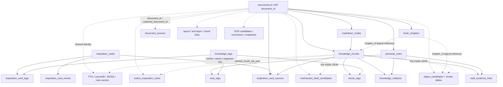

# Search 按书删除：真实依赖审计

## 1. 文档状态与边界

- 审计基线：`a562d7c267da70f7864f77ad45075747788b75a0`
- 产品范围：Search 资料库中的“按书删除”设计
- 用户计数单位：书
- 唯一删除身份：API 的 `document_id`，对应真实 SQLite 的 `documents.id`
- 本文仅记录只读审计结论；当前代码没有删除 API，也没有执行任何删除。

本次审计读取了 tracked 源码、迁移脚本、测试、构建入口，以及实际运行库的 schema 元数据。实际 SQLite 仅以 `mode=ro&immutable=1`、`PRAGMA query_only=ON` 读取 `sqlite_master`、`table_info`、`foreign_key_list`、索引和版本信息；未读取书名、正文、PDF 内容或业务行，未写主库、FTS、LanceDB、Zotero snapshot 或 manifest。

## 2. 结论摘要

1. 真实主库有 36 个业务表、25 条外键、0 条 `ON DELETE CASCADE`、0 个 trigger、0 个 view；`user_version=0`，没有 migration ledger。
2. `documents.id` 是真实主键。库中没有 `documents.document_id` 列；对外 API 应继续称 `document_id`，SQL 必须使用 `WHERE documents.id = :document_id`。
3. 当前不能依靠 ORM relationship 或数据库级联删除。所有外键都是 `NO ACTION`，而 SQLAlchemy engine 也未统一打开 `PRAGMA foreign_keys=ON`。
4. 多个关键关联没有外键：layout、OCR、document source、object、mechanism、Zotero note mapping、chapter review，以及 JSON 和多态关系都必须显式处理。
5. 当前正式 FTS 只有全量、临时文件构建和原子发布，没有可直接调用的单书增量删除契约。
6. LanceDB passage 向量有精确 ID 和底层 delete primitive，但没有完整的 document-scoped 删除、manifest 原子更新和恢复契约；object 向量按 `object_key` 身份共享，不能按 `document_id` 粗删。
7. 仍有正式调用方的 legacy `vector_index/chunks.jsonl` 和 Zotero note vector generation 也必须纳入一致性方案。
8. 当前没有通用删除 audit、持久 deletion operation、跨进程 document mutation lock。活动 PDF import 状态保存在运行态 JSON，而不在主库中。
9. `knowledge_relations` 和 `object_candidates` 的共享归属无法由现有 schema 在所有情况下安全判定。遇到归属不明必须让 preview 返回 `can_delete=false`，不能猜测或强删。
10. 原始 PDF、Zotero 原始条目/标注/笔记、外部 Markdown、模型权重，以及其他书仍引用的共享实体必须保留。

## 3. 真实 schema 来源与身份

### 3.1 Canonical 路径与数据库入口

- 数据目录、主库、FTS、LanceDB、Zotero 和运行态目录定义在 `app/core/paths.py:20-106`。
- SQLAlchemy engine 定义在 `app/db/session.py:11-14`，仅设置 `check_same_thread=False`，没有统一设置 foreign key pragma。
- 显式 SQLite 连接能力在 `app/core/database.py:18-147`；删除实现应使用“已有文件、读写、不允许隐式创建”的连接，并显式启用 foreign keys、超时和事务模式。
- 当前初始化由 `app/db/init_db.py:8-52` 的 `create_all` 与轻量列升级组成；没有 Alembic 或 schema version ledger。

### 3.2 书籍唯一身份

真实 `documents` 列包括：

```text
id (PRIMARY KEY)
title
document_type
content_layer
source_path
pdf_path
zotero_key
read_status
research_direction
object_import_mode
object_import_status
created_at
updated_at
```

`source_type` 不在 `documents`，而在 `document_sources.source_type`。当前也没有通用 `import_status`；`documents.object_import_status` 只是对象导入状态，不能代表 PDF import job 是否仍在运行。

当前书详情入口 `app/api/library/books.py:14-49` 仅提供 GET。`app/services/book_chapter_service.py:65-97` 通过 `Document.id == document_id` 精确读取，并把 chaptered 文档当作书籍详情。删除能力不能复用“必须是 chaptered”的详情限制：产品语义应明确为“一条 `documents.id` 是用户计数中的 1 本书”，文档类型只作元数据。

## 4. 真实依赖图

图中实线表示真实 SQLite FK，全部为 `ON DELETE NO ACTION`；虚线表示无 FK 的整数、JSON 或多态逻辑关联。



### 4.1 真实 FK 删除顺序约束

- `documents` ← `book_chapters`、`knowledge_chunks`、`markdown_nodes`、`personal_notes`、`inspiration_card_sources.source_doc_id`
- `markdown_nodes` ← `knowledge_chunks.node_id`
- `knowledge_chunks` ← `chunk_tags`、`note_evidence_links`、`knowledge_relations.evidence_chunk_id`、`inspiration_card_sources.source_chunk_id`
- `personal_notes` ← `note_tags`、`note_evidence_links`、`knowledge_relations.note_id`
- `knowledge_tags` ← `chunk_tags`、`note_tags`、`inspiration_card_tags`
- `inspiration_cards` ← `inspiration_card_sources`、`inspiration_card_tags`、`inspiration_card_events`
- 四组 review item → review root；human review root 还引用 draft review root

因此 `documents` 必须最后删除。`knowledge_chunks.chapter_id` 和 `object_candidates.chapter_id` 是对 `book_chapters.id` 的逻辑引用，但真实 schema 没有 FK，所以 chapter 必须晚于 chunk、object 和 review 数据处理。

## 5. 删除动作词典

| 代码 | 动作 | 含义 |
|---|---|---|
| A | 随书删除 | Search 内可证明仅属于目标书的记录 |
| B | 只删除本书关联 | 保留实体，只解除目标书、chunk、note 或 evidence 的链接 |
| C | 共享实体保留 | 不做孤立共享对象清理，不影响其他书引用 |
| D | 外部数据完全保留 | 原始 PDF、Zotero、外部 Markdown 等不写不删 |
| E | 缓存失效 | 清除或重建可再生缓存/索引，不删除外部源 |
| F | 暂不处理并阻止执行 | 当前 schema 无法安全证明归属；preview 必须给出 blocked reason |

## 6. 36 个真实主库表分类矩阵

| 实体或表名 | `document_id` 关联方式 | 外键或逻辑关联 | 专属/共享 | 动作 | 回滚要求 | 索引一致性要求 | 风险 |
|---|---|---|---|---|---|---|---|
| `documents` | `id` 即 API `document_id` | 主记录 | 专属 | A | SQL 事务内回滚；必须最后删且 `rowcount=1` | 删除前冻结精确 ID 计划 | 高 |
| `document_sources` | `document_id` | 无 FK；含 Zotero/source trace | 关联行专属，外部源共享 | B | 事务回滚 | 让外部 note/PDF mapping 重新解析 | 中 |
| `book_chapters` | `document_id` | FK → documents，NO ACTION | 专属 | A | 事务回滚 | 晚于 chunk/object/review | 中 |
| `markdown_nodes` | `document_id` | FK → documents；`parent_id` 自引用 | 专属 | A | 事务回滚 | 晚于 knowledge_chunks | 中 |
| `knowledge_chunks` | `document_id` | FK → documents；node FK；chapter 为逻辑引用 | 专属 | A | 事务回滚；先冻结 chunk IDs | FTS、Lance passage、legacy JSONL 必须归零 | 高 |
| `chunk_tags` | 经 `chunk_id` | FK → chunk/tag，NO ACTION | 关联专属，tag 共享 | B | 事务回滚 | 在 chunk 前删链接 | 低 |
| `knowledge_tags` | 经 chunk/note/card links | 无 document_id | 共享 | C | 不删除 | 其他书 tag 计数不变 | 中 |
| `personal_notes` | nullable `document_id` | FK → documents，NO ACTION；可能有外部 `source_path` | Search 内绑定副本专属；源文件外部 | A | 事务回滚；源文件不动 | note fragment 与 tag/evidence link 同步 | 中 |
| `note_evidence_links` | 经 `chunk_id`/`note_id` | 两条 FK，NO ACTION | 关联 | B | 事务回滚 | 在 note/chunk 前删 | 中 |
| `note_tags` | 经 `note_id` | FK → note/tag，NO ACTION | 关联专属，tag 共享 | B | 事务回滚 | 在绑定 note 前删 | 低 |
| `knowledge_relations` | `evidence_chunk_id`、`note_id`；另有 polymorphic source/target | 两条 FK + 无 FK 多态 ID | 可能共享 | F | 不可证明归属时不进入写事务 | 必须先有 relation ownership/evidence resolver | 高 |
| `inspiration_card_sources` | `source_doc_id`/`source_chunk_id` | FK → document/chunk/card，NO ACTION | 关联 | B | 事务回滚 | 在 document/chunk 前删目标关联 | 中 |
| `inspiration_cards` | 经 source links | 无 document_id | 用户/共享实体 | C | 不删除 | 允许卡片暂时没有该书来源 | 中 |
| `inspiration_card_tags` | 经 card/tag | FK → card/tag | 共享关联 | C | 不删除 | 不做孤立清理 | 低 |
| `inspiration_card_events` | 经 card | FK → card | 历史/共享 | C | 不删除 | 保留历史 | 低 |
| `object_candidates` | nullable `document_id`；chunk/note/evidence JSON | 无 FK；`object_key` 是逻辑身份 | 可能跨书共享 | F | 归属不明时阻止；不可按 document_id 粗删 | 需逐 object_key reconcile 向量/profile | 高 |
| `pdf_page_layout_blocks` | `document_id` | 真实 DDL 无 FK | 专属派生 | A | 事务回滚 | Preview/cache 必须失效 | 中 |
| `pdf_page_layout_lines` | `document_id` | 真实 DDL 无 FK | 专属派生 | A | 事务回滚 | Preview/cache 必须失效 | 中 |
| `pdf_page_layout_spans` | `document_id` | 真实 DDL 无 FK | 专属派生 | A | 事务回滚 | Preview/cache 必须失效 | 中 |
| `chunk_layout_links` | `document_id`/`chunk_id` | 真实 DDL 无 FK | 专属派生 | A | 事务回滚 | 在 chunk/layout block 前删 | 中 |
| `chunk_layout_line_links` | `document_id`/`chunk_id` | 无 FK | 专属派生 | A | 事务回滚 | 在 chunk/layout line 前删 | 中 |
| `pdf_page_text_layer_cache` | `document_id` | 无 FK | 可再生 | E | 事务回滚 | 目标书 cache 归零 | 低 |
| `ocr_first_chunk_candidates` | `document_id`；`replaces_chunk_ids_json` | 无 FK | 专属派生 | A | 事务回滚 | JSON 只用于冻结/验证目标 IDs | 中 |
| `ocr_first_candidate_corrections` | `document_id`/`candidate_id` | 无 FK | 专属派生 | A | 事务回滚 | 先于 candidate 删除 | 中 |
| `ocr_first_promote_snapshots` | `document_id`/`chunk_id` | 无 FK；含 line link JSON | 专属回滚数据 | A | 事务回滚 | 不得触及其他 promote run | 中 |
| `zotero_inspiration_notes` | `matched_document_id`/`matched_chunk_id`/JSON | 无 FK | note 本体外部/共享，mapping 属于本书 | B | 保留 note row/content；事务回滚 mapping | FTS/note vector 需重发 metadata，embedding 可复用 | 高 |
| `zotero_pdf_sources` | 通过 Zotero key/attachment 与 document_sources 映射 | 无 document FK | 全局 source cache | C | 不删除 | 允许 source 继续供以后重新导入 | 低 |
| `mechanism_draft_candidates` | `matched_document_id` + evidence/note JSON | 无 FK | 可能共享 | B | JSON 无法精确解析时阻止；事务回滚 | 清本书 evidence 后逐 mechanism 校验；不自动删实体 | 高 |
| `note_classification_reviews` | `document_id` | 无 FK 到 documents | Search 派生、书专属 | A | 事务回滚 | item 先于 root | 高 |
| `note_classification_review_items` | 经 `review_id` | FK → review root | Search 派生、书专属 | A | 事务回滚 | root 前删除 | 中 |
| `note_correction_reviews` | `document_id` | 无 FK 到 documents | Search 派生、书专属 | A | 事务回滚 | item 先于 root | 高 |
| `note_correction_review_items` | 经 `review_id` | FK → review root | Search 派生、书专属 | A | 事务回滚 | root 前删除 | 中 |
| `object_candidate_draft_reviews` | `document_id` | 无 FK 到 documents | Search 派生、书专属 | A | 事务回滚 | human review 后、items 后 | 高 |
| `object_candidate_draft_review_items` | `document_id` + evidence JSON | FK → draft root | Search 派生、书专属 | A | 事务回滚 | draft root 前删除 | 中 |
| `object_candidate_human_reviews` | `document_id` | FK → draft root | Search 派生、书专属 | A | 事务回滚 | human items 先 | 高 |
| `object_candidate_human_review_items` | `document_id` + evidence JSON | FK → human root | Search 派生、书专属 | A | 事务回滚 | human root 前删除 | 中 |

### 6.1 JSON 与多态引用清单

下列字段不能用外键扫描代替：

- `object_candidates.evidence_refs_json`
- `object_candidates.note_refs_json`
- `object_candidates.mapped_chunk_ids_json`
- `object_candidates.source_note_ids_json`
- `mechanism_draft_candidates.source_inspiration_note_ids_json`
- `mechanism_draft_candidates.bound_inspiration_note_ids_json`
- `mechanism_draft_candidates.evidence_chunk_ids_json`
- `mechanism_draft_candidates.draft_json`
- `zotero_inspiration_notes.matched_chunk_ids_json`
- `zotero_inspiration_notes.matched_object_ids_json`
- review item 的 `evidence_chunk_ids_json`
- OCR 的 `replaces_chunk_ids_json`、`old_line_links_json`
- `knowledge_relations.source_type/source_id/target_type/target_id`

任何 JSON 解析错误、未知 schema version、未知 polymorphic type 或跨书引用歧义都必须进入 `blocked_reasons`，不能静默忽略。

## 7. 非主库实体与文件分类矩阵

| 实体或 artifact | document 关联 | 专属/共享 | 动作 | 回滚/一致性要求 | 风险 |
|---|---|---|---|---|---|
| FTS `retrieval_fragments` | nullable `document_id`，`row_id` 对齐两套 FTS | PDF fragment 专属；Zotero fragment 需保留并解绑 | A+B | 第一版全量原子重建；不直接 patch production 文件 | 高 |
| `retrieval_fts_unicode` / `retrieval_fts_trigram` | 仅通过 rowid | 派生 | E | 与 ordinary table 同一 candidate DB 验证 | 中 |
| FTS manifest | 全库文件 SHA、source counts、index SHA | 全局 | E | 与 FTS candidate 一起原子发布 | 高 |
| Lance `passage_embeddings` | `chunk:{document_id}:{chunk_id}` + direct fields | 专属 | A | 精确 ID 白名单删除，校验其他 ID 不变 | 中 |
| Lance `object_embeddings` | `object:{object_key}` | 跨书共享 | B | 逐受影响 object_key：仍存在则 upsert，不存在才删 | 高 |
| Lance manifest | aggregate counts，无 per-document map | 全局 | E | 实际 recount 后原子写；失败保 reconciliation pending | 高 |
| legacy `vector_index/chunks.jsonl` | 每行含 document_id/chunk_id | 专属行 | A | 临时 pair 过滤重写，其他行顺序/内容稳定 | 中 |
| legacy vector manifest | aggregate count/model metadata | 全局 | E | 与 JSONL pair 原子发布 | 中 |
| Zotero note vector generation | entry 含 document_id | note 向量共享，mapping 可变 | B | 复用 embedding，仅 metadata 变化也必须发布新 generation | 高 |
| FTS/evidence status caches | 文件签名/mtime | 可再生 | E | 发布后换 key或显式清理 | 低 |
| local embedding runtime cache | chunk ID/text | 可再生 | E | 清目标 chunk cache | 低 |
| object profile cache | object_key | 共享且受 evidence 影响 | E | 清受影响 object keys | 高 |
| 前端统一 `searchSession` | result/basket/preview 含 document_id | 当前进程内状态 | E | exact ID 过滤，不清其他书/query/mode/scroll | 中 |
| Workspace route/state | documentId/chapterId | 当前进程内状态 | E | 目标书 route 清空并回安全页 | 低 |
| Evidence Basket | item.document_id | 当前进程内状态 | E | 移除目标书证据并重排 | 低 |
| PDF Preview/locator cache | document/chunk | 当前进程内状态 | E | 命中目标即关闭；locator 无反向映射时清全 cache | 低 |
| runtime import jobs | status JSON 内 path，完成后可能有 document_id | 运行态/审计 | F | 活动 job 阻止删除；不得猜目录并删除 | 高 |
| source PDF | documents/document_sources/Zotero path | 外部源 | D | 第一版绝不删除或改名 | 低 |
| Zotero library、snapshot、原始 note/annotation | Zotero key/attachment | 外部源 | D | 只读；不得写 | 低 |
| converted Markdown / Marker output | 路径常由 title/stem 推导，无 owner manifest | 归属不可证明 | F | 第一版保留；不得按标题/文件名删 | 高 |
| cover | 当前由前端按 PDF 现场渲染，无独立文件 cache | 可再生 | E | 无文件删除动作 | 低 |
| model weights | 无 document 关联 | 全局共享 | D | 不触及 | 低 |
| build/cache data | 无 document 关联 | 全局 | D | 不以删除书为由清理 | 低 |
| export files | 当前无主库 export record；用户文件无 owner manifest | 外部输出 | F | 第一版不处理 | 中 |

## 8. 当前索引的单书删除能力

### 8.1 SQLite FTS：当前不支持正式单书增量删除

真实 FTS schema 有：

- ordinary `retrieval_fragments`，其中 `document_id` 有索引；
- `retrieval_fts_unicode`；
- `retrieval_fts_trigram`；
- 两个 FTS 表通过 rowid 与 `retrieval_fragments.row_id` 对齐；没有 trigger 和 FK。

源码 `app/services/retrieval/fts_index_service.py:94-205` 只有全量 build；`app/services/retrieval/fts_index_service.py:323-369` 已提供 candidate 文件、校验、原子发布和失败恢复。Manifest 在 `app/services/retrieval/fts_index_service.py:148-166` 记录整个主库、Zotero snapshot 和本地 Markdown 的 aggregate fingerprint。

理论上可以按 `document_id → row_id` 删除三处行，但当前没有正式服务，且只删 `document_id` 行会错误处理需要“保留但解除 mapping”的 Zotero notes。第一版应复用全量 source registry 和原子 rebuild：

- 已删除书的 PDF fragments 消失；
- Zotero 原始 fragments 保留，但重新解析为未映射或映射到仍存在的文档；
- manifest 与最终主库保持一致。

结论：第一版需要全量重建 FTS，但不需要重建生产向量或重算其他书 embedding。

### 8.2 Lance passage：底层可精确删，正式契约缺失

`app/services/vector_store_service.py:414-439` 定义 passage ID 为 `chunk:{document_id}:{chunk_id}`。`app/services/vector_store_service.py:1055-1059` 有精确 delete primitive。

但是 `sync_affected_passage_embeddings()` 对已经从 SQLite 消失的 source 只标记 `orphan`，明确不删除 orphan，也不更新 manifest。实施必须新增 public document-scoped cleanup，只接受 preview 固定的 exact vector ID 白名单，不得调用全库 `delete_orphans=True`。

### 8.3 Lance object：不得按 document_id 删除

object vector ID 是 `object:{object_key}`。同一 object key 可能被多本书使用；删除一本书后 profile、代表 evidence 和 primary document 都可能变化。必须只对 preview 固定的受影响 object keys 逐个 reconcile：

- 仍有 surviving source：upsert 新 profile；
- 无 surviving source：精确删除该 key；
- 其他 object key：不扫描、不写。

### 8.4 legacy JSONL：仍有正式调用方

`app/services/vector_index_service.py` 的 `chunks.jsonl` 每行含 document_id/chunk_id，仍被 CLI、hybrid retrieval 和 research session 使用。当前只有全量覆写，没有 pair 级原子 publish。第一版应做 exact document filter + temporary JSONL/manifest pair + validation + atomic replace，不应重新 embedding 其他书。

### 8.5 Zotero note vector：保留向量，更新 mapping metadata

当前 generation entry 保存 document_id，但内容 hash 不覆盖 document_id。若 note 文本不变、只从目标书解绑，现有增量逻辑可能复用旧 manifest 而留下 stale mapping。实施必须让 entry metadata/payload hash 参与变更检测，复用 embedding 但发布新 generation。

## 9. Schema drift 与缺失能力

### 9.1 真实 DDL 与 ORM 不一致

`app/models/pdf_layout.py` 声明了若干 FK，但 `app/services/pdf_layout_service.py:87-220` 的真实建表 DDL没有这些 FK，实际库同样没有。删除计划必须以实际 schema capability probe 为准，不能只看 ORM。

`DocumentSource` 和 `ObjectCandidate` 的 model 本身也没有 document FK。真实库中不存在 tracked model 所描述的 `accepted_tag_changes` 和 `production_audit_records`；它们没有注册为当前生产删除 audit，且后者的约束只适用于旧 tag patch 领域，不能复用。

### 9.2 当前不存在的主库实体

实际主库没有：

- `import_jobs`
- 通用 `audit_log`
- `saved_sessions`
- `export_records`
- 通用 `objects` / `object_document_links`
- 通用 `mechanisms` / `mechanism_document_links`
- 独立 `relation_evidence`
- migration version/ledger

因此 preview 的 shared object/relation/mechanism 计数必须来自现有 direct/JSON/multitype links 的保守 resolver，不能假定这些正规化表存在。

### 9.3 缺少索引

实际 schema 中以下精确 document 扫描缺少索引：

- `object_candidates.document_id`
- `chunk_layout_line_links.document_id`
- `ocr_first_promote_snapshots.document_id`

实现前应以独立 schema migration 增加这三个索引；本 design-only 阶段不修改 schema。

## 10. 当前正式前端与用户状态

- canonical 书架：`frontend/src/pages/ReadShelfPage.jsx`
- canonical 详情页：`frontend/src/pages/DocumentDetailPage.jsx`
- `BookDetailPage.jsx` 是保留的 legacy path，不是正式渲染入口
- canonical Search：`frontend/src/pages/LocalRetrievalPage.jsx`
- 唯一搜索 session：`frontend/src/features/retrieval/state/searchSession.js`
- canonical Preview：`frontend/src/PdfLocationPreview.jsx`，由 `SearchPreviewPanel.jsx` 复用

`LocalRetrievalPage` 把 query、search kind、FTS mode、filters、results、Preview、Evidence Basket 和 scroll 写入唯一内存 searchSession。Workspace 只读取这一 session，没有第二套搜索状态，也没有 localStorage/IndexedDB 持久副本。

书架 duplicate card 当前点击会打开 `duplicate_primary_document_id || document_id`。删除菜单必须始终绑定卡片自身 `item.document_id`，绝不能沿用 duplicate primary，也不能用标题定位。

## 11. 审计结论与实施前置条件

可以安全进入实现的前提是：

1. 新增持久、非生产语料库的 deletion journal 与跨进程 mutation guard；
2. preview 能对 36 表、JSON、多态 links 和四套索引计算 exact plan/hash；
3. relation/object 归属不明时明确阻止；
4. 活动 import、对象/机制写入或索引写入时阻止；
5. FTS 采用最终主库状态的原子全量 rebuild；
6. Lance passage、object、legacy JSONL、Zotero note vectors 均有 exact、可重试、manifest-safe 的 cleanup；
7. 搜索在 operation 未完成时 fail closed，不消费 stale derived store；
8. 前端只按 document_id 失效目标书状态，保留其他书和统一搜索 session 的其余内容。

在这些条件未满足前，不应暴露真实 DELETE 按钮或宣称按书删除可用。
