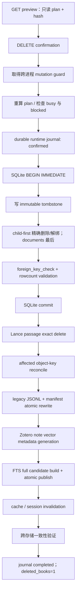

# Search 按书删除：实施设计

## 1. 状态

本文是 design-only 实施方案。当前版本尚未实现真实删除；本文中的 API、service、migration、前端按钮和测试均为待批准工作。

设计依据见 [SearchBookDeletionDependencyAudit.md](SearchBookDeletionDependencyAudit.md)。

## 2. 产品契约

### 2.1 用户语义

- 一条 `documents.id` 对用户计数为 1 本书。
- 所有主提示使用“本”：`删除 1 本书`、`已删除 1 本书`、`已选择 3 本书`。
- chunks、FTS rows、vectors、links 只出现在折叠技术详情和 audit 中。
- 唯一删除身份是 `document_id`；标题只作为二次确认，不参与定位或 SQL `WHERE`。

### 2.2 删除范围

删除一本书表示从 Search 资料库删除：

- `documents` 主记录；
- 该书专属的 Search chunks、chapter、layout、OCR、review 等派生记录；
- 该书专属的 FTS、passage vector 和 legacy vector records；
- 该书与 note/object/relation/mechanism/card/tag 的关联；
- 前端当前进程中指向该书的 Search/Preview/Workspace/Evidence Basket 状态。

默认保留：

- 磁盘原始 PDF；
- Zotero 原始条目、attachment、annotation 和 note；
- 外部 Markdown/Marker 输出；
- 其他书仍引用的 object、tag、relation、mechanism、inspiration card；
- 模型权重、其他书的数据库行和索引；
- 已存在的用户导出文件。

第一版不提供“同时删除原始 PDF”，不按标题/文件名清文件，不做全库孤立对象清理。

### 2.3 不变量

1. `document_id` 必须是正整数，且 path、confirmation、plan 三者一致。
2. 任意失败都不能把“删除成功”显示给用户。
3. `deleted_books` 是执行主结果；成功单本删除只能是 `1`。
4. 其他书的业务实体和检索语义不变。
5. 原始 PDF 和 Zotero 数据从不进入 write set。
6. 所有主库 DELETE 使用静态 allowlist SQL、参数绑定、非空 `WHERE` 和预期 rowcount。
7. 共享归属不明时阻止删除，不以“清理干净”为由猜测。
8. derived store 未验证前，Search 不消费可能 stale 的索引。

## 3. API 契约

### 3.1 单本删除预览

```http
GET /api/v1/library/books/{document_id}/delete-preview
```

约束：

- FastAPI path 使用正整数约束；`0`、负数、非整数返回 422；空 path 不匹配路由。
- 合法但不存在的 `document_id` 返回 404。
- GET 完全只读，不创建 operation，不写 audit，不更新 manifest。
- preview 在真实主库、FTS、vector manifests、runtime jobs 上计算计划；不读取 PDF 正文。
- `plan_hash` 覆盖 document identity fingerprint、目标 ID 集合 hash、计数、schema capability 和相关 manifest generation。它不包含正文或文件路径。

建议响应：

```json
{
  "status": "ok",
  "book_count": 1,
  "book": {
    "document_id": 42,
    "title": "示例书名"
  },
  "can_delete": true,
  "blocked_reasons": [],
  "warnings": [],
  "plan_hash": "sha256:...",
  "will_delete": {
    "books": 1,
    "chunks": 76,
    "fts_records": 76,
    "passage_vectors": 76,
    "legacy_vector_records": 76,
    "exclusive_links": 5
  },
  "will_unlink": {
    "shared_objects": 4,
    "shared_tags": 6,
    "shared_relations": 1,
    "shared_mechanisms": 2,
    "zotero_notes": 3
  },
  "will_keep": {
    "source_pdf": true,
    "zotero_source": true,
    "external_markdown": true,
    "shared_entities": true
  },
  "technical_details": {
    "fts_strategy": "atomic_full_rebuild",
    "passage_vector_strategy": "exact_id_delete",
    "object_vector_strategy": "affected_key_reconcile"
  }
}
```

`fts_records` 表示目标书专属 fragment 数，不是本次全量 rebuild 写入的总行数。

### 3.2 单本执行

```http
DELETE /api/v1/library/books/{document_id}
Idempotency-Key: <client-generated-uuid>
Content-Type: application/json
```

请求：

```json
{
  "confirm_document_id": 42,
  "confirm_title": "示例书名",
  "confirm_plan_hash": "sha256:..."
}
```

规则：

- `Idempotency-Key` 必填、非空、长度受限；不得用 document_id 或标题自动生成。
- path ID 与 `confirm_document_id` 必须完全一致。
- `confirm_title` 与当前 DB title 逐字一致；只用于二次确认，不进入 SQL predicate。
- 服务在持有 mutation guard 和 `BEGIN IMMEDIATE` 后重新计算 plan；hash 不一致返回 409。
- 不接受 `delete_source_pdf`、glob、title selector、document range 或空列表。
- 第一版同步执行持久 saga，不引入独立任务队列；operation journal 使崩溃后可恢复。

成功响应：

```json
{
  "status": "completed",
  "operation_id": "book-delete-...",
  "document_id": 42,
  "deleted_books": 1,
  "already_completed": false,
  "deleted": {
    "chunks": 76,
    "fts_records": 76,
    "passage_vectors": 76,
    "legacy_vector_records": 76
  },
  "unlinked": {
    "shared_objects": 4,
    "shared_tags": 6,
    "shared_relations": 1,
    "shared_mechanisms": 2,
    "zotero_notes": 3
  },
  "kept": {
    "source_pdf": true,
    "zotero_source": true,
    "external_markdown": true
  }
}
```

### 3.3 Operation 状态

```http
GET /api/v1/library/book-deletions/{operation_id}
```

该接口只返回 stage、用户计数、技术计数、错误码、重试需求和时间，不返回 PDF 正文、note 正文、embedding、source path 或 credentials。

建议状态：

```text
confirmed
sqlite_committed
passage_vectors_done
object_vectors_done
legacy_vector_done
note_vectors_done
fts_done
caches_invalidated
completed
failed_no_write
failed_retryable
```

### 3.4 错误状态

| HTTP | code | 语义 | `deleted_books` |
|---|---|---|---|
| 404 | `book_not_found` | 合法 ID 从未存在，或使用新 idempotency key 重删 | 0 |
| 409 | `confirmation_document_mismatch` | path/body ID 不同 | 0 |
| 409 | `confirmation_title_mismatch` | title 已变化或输入错误 | 0 |
| 409 | `delete_plan_stale` | preview 后依赖、schema 或 index generation 改变 | 0 |
| 409 | `book_busy` | 正在导入、写 object/mechanism/index | 0 |
| 409 | `unsafe_shared_dependency` | relation/object/JSON 归属不可证明 | 0 |
| 423 | `mutation_guard_locked` | 其他受控 mutation 正在运行 | 0 |
| 503 | `deletion_reconciliation_required` | SQLite 已提交、derived cleanup 未完成 | 0 |
| 500 | `deletion_failed_no_write` | 主事务提交前失败并已回滚 | 0 |

503 payload 必须包含 `operation_id`、`failure_stage`、`reconciliation_required=true` 和可安全显示的错误码；不得写“已删除 1 本书”。

### 3.5 重复删除与幂等

- 同一 `Idempotency-Key`、同一 document identity、同一 confirmation 的重试：恢复或返回原 operation。
- operation 已完成：200，`deleted_books=1`，`already_completed=true`；这是同一请求的重放，不是再次删除。
- 新 idempotency key 请求已不存在的 ID：404。
- ID 以后被 SQLite 重用时，旧 idempotency key 不得作用于新文档；journal/tombstone 还要比较 immutable document fingerprint 和 plan hash。

### 3.6 批量 API（二期设计）

为避免静态路径与 `/books/{document_id}` 的 int dynamic route 顺序冲突，二期使用：

```http
POST /api/v1/library/book-deletions/preview
POST /api/v1/library/book-deletions/execute
```

预览 body：

```json
{
  "document_ids": [42, 57, 61]
}
```

执行 body：

```json
{
  "books": [
    {"document_id": 42, "confirm_title": "...", "confirm_plan_hash": "sha256:..."},
    {"document_id": 57, "confirm_title": "...", "confirm_plan_hash": "sha256:..."},
    {"document_id": 61, "confirm_title": "...", "confirm_plan_hash": "sha256:..."}
  ]
}
```

批量规则：IDs 必须唯一、正整数、有数量上限；不接受 title-only、range、wildcard。SQLite 主事务 all-or-none；任一本 blocked 则整批不开始。用户主字段为 `book_count` 和 `deleted_books`。

## 4. 安全与并发设计

### 4.1 Mutation guard

当前没有统一的 per-document 或全局 mutation coordinator。第一版在 `RUNTIME_STATE_DIR` 建立跨进程 guard，所有 canonical writer 共享：

- PDF import commit 与 chaptered worker；
- paper/book/object commit；
- object/chapter review 正式写入；
- mechanism draft 正式写入；
- FTS build；
- Lance sync/worker；
- legacy vector rebuild；
- Zotero note vector publish；
- book deletion。

删除 preflight 同时读取 runtime import job status：

- status 为 queued/running 时阻止；
- job 已有 document_id 时按 exact ID 匹配；
- job 尚未产生 ID 时，用目标 document 的规范化 `pdf_path`/`source_path` 与 job path 精确比较；
- 不按标题匹配。

所有 writers 在取得 guard 后仍需重查 persistent journal，防止进程崩溃释放 OS lock 后在未完成 reconciliation 上继续写。

### 4.2 SQL 防护

- 使用现有文件的 read/write URI；禁止 `rwc` 隐式创建空库。
- `PRAGMA foreign_keys=ON`、合理 busy timeout、`BEGIN IMMEDIATE`。
- repository 只暴露 `document_id: int`，不暴露任意 SQL/table/filter。
- 表名和 SQL 模板静态 allowlist；值全部参数绑定。
- 每个 DELETE 都有 `WHERE`；目标 ID/ID list 不能为空。
- 单本最终 `DELETE FROM documents WHERE id = ?`，并断言 rowcount 为 1。
- 事务中重新读 title、updated_at、依赖 IDs、active operation 和 plan hash。
- commit 前运行 `PRAGMA foreign_key_check`；测试和 post-check 运行 `integrity_check`。

### 4.3 JSON 与共享实体策略

- JSON 必须是预期 list/object schema；解析失败直接 blocked。
- `knowledge_relations` 的 polymorphic type 必须在 allowlist；未知 type blocked。
- object candidate 先按目标 document_id 取 exact rows，再按 object_key 检查 surviving candidates 和入站引用。
- shared object key 保留；只删除目标书 candidate/link，并在向量层逐 key reconcile。
- mechanism candidate 保留；只过滤本书 evidence/note mapping。失去全部证据时标记为需要复审，不做自动孤立删除。
- tag、inspiration card、外部 Zotero entity 永远不做 orphan cleanup。

## 5. 持久 journal、tombstone 与 audit

### 5.1 选定方案

第一版采用两层最小 journal：

1. 主库中的 immutable `document_deletion_tombstones`：与 document hard delete 同一事务写入，之后不更新；用于幂等、恢复和最低限度 audit。
2. `RUNTIME_STATE_DIR/book_deletions/operations.sqlite3`：记录可变 stage、错误、重试和验证结果；不属于 production corpus。

这样做的原因：当前 FTS manifest 使用整个主库文件 SHA。若把频繁变化的 operation status 放进主库，每次 stage 更新都会让刚发布的 FTS 再次 stale。Immutable tombstone 在 FTS rebuild 前已写定，后续 runtime journal 更新不会改变主库 fingerprint。

### 5.2 Immutable tombstone 字段

建议只保存：

- operation_id
- idempotency_key
- document_id
- document identity fingerprint
- title snapshot
- confirm plan hash
- cleanup target IDs 或其可恢复的结构化列表
- 每类计数
- deleted_at

禁止保存：

- PDF 正文、chunk 正文、note 正文；
- embedding；
- PDF/source absolute path；
- Zotero credentials、Tunnel credentials；
- API token/cookie。

### 5.3 Runtime operation journal

Runtime journal 使用 `synchronous=FULL`、versioned schema 和原子事务。大 ID 集可放在 `book_deletion_operation_items`，按 `kind + target_id` 唯一，而不是把不可控大 JSON 塞进日志行。

它是删除恢复状态，不是另一套业务数据库；仓库不提交该文件，测试必须把 `SEARCH_RUNTIME_DIR` 指到临时目录。

## 6. 执行事务与索引一致性

### 6.1 Canonical 流程



FTS 放在最后，因为它需要读取最终主库状态并生成与最终主库 fingerprint 一致的 manifest。

### 6.2 SQLite child-first 顺序

精确顺序由 preview 固定 ID 集决定，建议：

1. human review items → human review roots；
2. draft review items → draft review roots；
3. classification/correction review items → roots；
4. inspiration source links；
5. 已证明安全的 relation/object/mechanism/Zotero links；
6. note evidence links、chunk tags、note tags；
7. layout links、text cache、layout spans/lines/blocks；
8. OCR corrections、candidates、promote snapshots；
9. Search personal note copies；
10. knowledge chunks；
11. markdown nodes；
12. book chapters、document sources；
13. documents。

所有 counts 必须与 preview/transaction replan 一致；异常 rowcount 立即 rollback。

### 6.3 Derived store 处理

#### FTS

- 不在第一版做 production 原地 row patch。
- 从最终主库、Zotero snapshot、Markdown registry 构建新 candidate。
- validate ordinary/两个 FTS counts、integrity、manifest hash 和 source fingerprint。
- 使用现有 atomic publish/rollback。
- 旧 index 因主库 fingerprint 变化会被 status 判为 stale；operation 未完成期间检索必须 fail closed。

#### Lance passage

- journal 持久保存 exact `chunk:{document_id}:{chunk_id}` IDs。
- 校验 ID 的 document segment 与目标一致。
- 精确 delete；重复 delete 是 no-op。
- 实际 recount 后更新 manifest；目标 IDs 为 0、非目标 sampling/count 不变。
- 禁止全库 orphan cleanup。

#### Lance object

- 只处理 preview 固定的 affected object keys。
- SQLite 删除后重新收集每个 key：有 surviving source 则重建该 profile 并 upsert；没有才精确 delete。
- 清该 key 的 runtime profile cache。
- 不扫描、不写未受影响 keys。

#### Legacy vector JSONL

- 流式读取原 JSONL，按 exact numeric document_id 过滤。
- 临时写 JSONL 和 manifest pair；校验 count、JSON schema、其他行内容/顺序。
- pair 原子发布，失败恢复旧 pair。
- 不重新计算其他书 embedding。

#### Zotero note vector

- Zotero note row保留，但 document/chunk mapping 已在 SQLite 事务中解除。
- metadata/payload hash 必须覆盖 document mapping 变化。
- 复用不变的 embedding，发布新 generation 和 manifest。
- 验证 note 仍可搜索/打开 Zotero，但不再指向已删除 document。

### 6.4 为什么不做跨存储伪事务

SQLite、LanceDB、FTS 文件和 JSON manifests 无法共享 ACID transaction。第一版不实现二阶段提交，也不为每本书复制正文 preimage。可靠性来自：

- 主库一个明确事务；
- 提交前 rollback；
- immutable cleanup plan/tombstone；
- derived store 精确、幂等、可重建；
- operation 未完成时 fail closed；
- 提交后只做前向 reconciliation。

## 7. 回滚、补偿和崩溃恢复

### 7.1 SQLite 提交前

- 任何 confirmation、plan、busy、JSON、rowcount、FK 检查失败：rollback。
- tombstone 与业务 DELETE 在同一事务，所以不会留下“已删”假记录。
- journal 标 `failed_no_write`，用户主结果 `deleted_books=0`。

### 7.2 SQLite 提交后

不自动恢复已删主库 rows。恢复正文 preimage 会扩大敏感数据持久化、引入复杂 FK/ID 重放，并可能覆盖并发新数据。第一版采用前向补偿：

- FTS 失败：旧 FTS 保持原子不变但被 source fingerprint 判 stale；重试全量 build。
- passage vector 失败：按 tombstone exact vector IDs 重试删除。
- object vector 失败：按 affected keys 重新收集 surviving source，再 upsert/delete。
- manifest 失败：从实际 table/file recount，原子重写；不猜旧 count。
- legacy pair 失败：保留/恢复旧 pair，再重试 filter rewrite。
- note vector 失败：复用 embedding，重发 metadata generation。
- cache 失败：重复失效操作。

在 reconciliation 完成前：

- journal 为 `failed_retryable`；
- Search 的 derived retrieval 返回明确 degraded/unavailable，不展示 stale target；
- canonical writers 读取 persistent pending operation 并拒绝开始；
- UI 显示“删除尚未完成”，不显示成功。

同一 idempotency key 重发 DELETE 可恢复 operation。启动时只读检测未完成 operation 并报告；不自动下载模型或静默执行不可预测的重建。

### 7.3 Integrity 验证

成功前至少验证：

- 主库 `documents.id`、专属 rows、target links 为 0；
- `PRAGMA integrity_check = ok`；
- `PRAGMA foreign_key_check` 无行；
- source PDF fixture 仍存在且 hash 不变；
- Zotero fixture 数据和 hash 不变；
- FTS status ready，target PDF fragments 为 0；
- external Zotero fragments 仍存在但 mapping 正确；
- Lance target passage IDs 为 0；
- shared object keys 仍存在且 profile 不含被删 evidence；
- legacy vector target rows 为 0；
- manifests count 等于实际；
- 其他书 snapshot 语义不变。

## 8. 前端交互设计

### 8.1 入口

1. `ReadShelfPage` 书卡右上菜单：`删除书籍`
2. canonical `DocumentDetailPage` 的详情操作区：`删除书籍`

不要修改或依赖 legacy `BookDetailPage.jsx`。

书卡有 duplicate primary 跳转逻辑；删除按钮必须捕获当前 card 的 `item.document_id` 并 `stopPropagation()`。详情页使用当前 `document.document_id`。

### 8.2 Dialog

打开 dialog 后先请求 delete-preview。标题和固定文案：

```text
删除《书名》？

这将从 Search 资料库中删除这本书、搜索索引和派生记录。

不会删除：
- 原始 PDF
- Zotero 原始条目和笔记
- 其他书仍使用的对象、关系和机制
```

主按钮：`删除 1 本书`

完成：`已删除 1 本书`

技术 counts 放在默认折叠的 `<details>` 中。第一版不显示“删除原始 PDF”checkbox。Preview 的 ID/title 与 target 不一致、`can_delete=false`、请求中或 operation 未完成时按钮禁用；双击只能发一次 DELETE。

### 8.3 删除完成后的状态失效

成功处理集中在 App-level callback：

1. 刷新书架；
2. 从 readShelf state 精确移除 target；
3. 清 selectedDocumentId/document detail/evidence/object/Zotero candidate state；
4. 目标详情页使用 `history.replaceState` 回 `/read-shelf`，避免 Back 回到失效详情；
5. 清 Workspace target route，回书架或安全空状态；
6. 对唯一 `searchSession` 执行 `invalidateSearchSessionDocument(documentId)`：
   - 过滤 results；
   - 移除 Evidence Basket items；
   - target Preview 设 idle；
   - target document filter/last request 失效；
   - 修正 total/total_count；
   - 保留 query、mode、其他 filters、其他书 results、scroll；
7. locator cache 当前没有 document 反向索引，第一版清全 cache；
8. 下一次 search 从 backend 获得新结果。

失败时不改变 shelf/session/Preview/Workspace，不显示“已删除”。

## 9. 精确测试矩阵

所有测试必须使用临时 SQLite、临时 FTS、临时 LanceDB、临时 JSONL/manifest、临时 runtime journal、临时 Zotero snapshot 和临时 PDF fixture。测试环境必须把 `SEARCH_DATA_DIR`、`SEARCH_RUNTIME_DIR`、TEMP/TMP 指到项目测试临时目录；禁止读取、复制或删除 production 书籍。

### 9.1 Schema、repository 与 API

| ID | 场景 | 断言 |
|---|---|---|
| API-01 | 单本预览 | `book_count=1`；counts 正确；GET 无写入 |
| API-02 | 正整数边界 | 0/负数/非整数 422；空 path 不匹配 |
| API-03 | 不存在的书 | 404 `book_not_found` |
| API-04 | document_id 精确边界 | 删除 12 不匹配 112；所有 SQL 参数绑定 |
| API-05 | 错误确认：confirm_document_id | 409；任何 store 0 writes |
| API-06 | 错误确认：confirm_title | 409；SQL 不使用 title predicate |
| API-07 | stale plan hash | 409；重新 preview 后才可执行 |
| API-08 | 空/缺 idempotency key | 拒绝；不创建 operation |
| API-09 | 单本成功 | 主结果 `deleted_books=1`；技术 counts 次级 |
| API-10 | 同 key 重试 | 返回同 operation，`already_completed=true`，不重复写 |
| API-11 | 新 key 重删 | 404 |
| API-12 | DELETE CORS | Vite origin preflight 允许 DELETE，仅允许配置 origin |
| API-13 | route metadata | product route 标 write + requires_confirmation |
| API-14 | 无 wildcard/title delete | schema/API 不接受 selector、range、glob |
| API-15 | static SQL contract | 每个 DELETE 含 WHERE；空 ID list 抛错 |
| DB-01 | child-first transaction | FK enabled 下完整删除成功 |
| DB-02 | 中途 SQL 失败 | 全事务 rollback；tombstone 不存在 |
| DB-03 | rowcount 异常 | rollback + `failed_no_write` |
| DB-04 | integrity | `integrity_check=ok`，`foreign_key_check=[]` |
| DB-05 | no-cascade contract | 测试不依赖 cascade/ORM relationship |

### 9.2 安全、共享实体与外部数据

| ID | 场景 | 断言 |
|---|---|---|
| SAFE-01 | 正在导入 | queued/running job 按 exact ID/path 阻止 |
| SAFE-02 | 正在写 object/mechanism | mutation guard 阻止 |
| SAFE-03 | 正在写 index | mutation guard 阻止 |
| SAFE-04 | preview→DELETE TOCTOU | 事务内 replan 检出变化并 409 |
| SAFE-05 | PDF 保留 | fixture 文件存在、hash 不变 |
| SAFE-06 | Zotero 保留 | snapshot/fixture row 和 hash 不变 |
| SAFE-07 | external Markdown 保留 | 文件存在、hash 不变 |
| SAFE-08 | chunks 删除 | 仅目标 document chunks 为 0 |
| SAFE-09 | shared tag 保留 | tag row 和其他 links 不变 |
| SAFE-10 | inspiration card 保留 | 仅 target source link 移除 |
| SAFE-11 | Zotero note unlink | note/content 保留，matched document/chunk 清除 |
| SAFE-12 | shared object | surviving candidate/key 保留，target evidence 移除 |
| SAFE-13 | exclusive object | 仅经 resolver 证明后删；向量精确删 |
| SAFE-14 | shared mechanism | candidate 保留，本书 evidence 过滤 |
| SAFE-15 | ambiguous relation/object JSON | preview `can_delete=false`，无写入 |
| SAFE-16 | 其他书完全不变 | 主库 logical snapshot 一致；shared intentional update 单列验证 |
| SAFE-17 | audit privacy | tombstone/journal 无正文、path、embedding、credential |

### 9.3 FTS、向量、manifest 与恢复

| ID | 场景 | 断言 |
|---|---|---|
| IDX-01 | FTS rebuild | target PDF fragments 0；两个 FTS/ordinary counts 一致 |
| IDX-02 | Zotero FTS remap | external note fragment 保留，document mapping 更新 |
| IDX-03 | FTS publish 失败 | 旧 pair 原子保留；status stale/fail closed；可重试 |
| IDX-04 | FTS final fingerprint | manifest 对应最终主库，不被 runtime journal 更新影响 |
| IDX-05 | Lance passage | exact vector IDs 为 0；其他 vectors 不变 |
| IDX-06 | vector ID validation | 不同 document segment 被拒绝 |
| IDX-07 | Lance shared object | 逐 key upsert，未受影响 key 不写 |
| IDX-08 | Lance exclusive object | 无 surviving source 时精确 delete |
| IDX-09 | unrelated orphan | 不做全局 orphan cleanup |
| IDX-10 | Lance manifest 失败 | journal pending；recount + retry 后一致 |
| IDX-11 | legacy JSONL | target rows 0；其他行字节/顺序稳定 |
| IDX-12 | legacy pair publish 失败 | 旧 JSONL/manifest pair 恢复 |
| IDX-13 | note vector metadata-only change | embedding 调用 0，仍发布新 generation |
| IDX-14 | SQLite 成功/vector 失败 | 503、`deleted_books=0`、fail closed、同 key 可恢复 |
| IDX-15 | crash after SQLite commit | tombstone 重建 journal，exact cleanup 可继续 |
| IDX-16 | crash after partial derived cleanup | 重复操作幂等，最终 manifests/counts 一致 |
| IDX-17 | cache invalidation | target chunk/object/status caches 不再返回旧结果 |

### 9.4 前端与 Desktop

| ID | 场景 | 断言 |
|---|---|---|
| UI-01 | shelf card 菜单 | 显示“删除书籍”，使用 card 自身 document_id |
| UI-02 | duplicate card | 不使用 duplicate_primary_document_id 删除 |
| UI-03 | detail 入口 | canonical DocumentDetailPage 可打开 dialog |
| UI-04 | preview dialog | 固定说明、保留项和 `<details>` 技术 counts |
| UI-05 | 用户单位 | 主按钮“删除 1 本书”，成功“已删除 1 本书” |
| UI-06 | 无 PDF delete 选项 | DOM 和请求均无该能力 |
| UI-07 | 二次确认 body | exact ID/title/plan hash；DELETE 只发一次 |
| UI-08 | blocked preview | 按钮禁用并显示原因 |
| UI-09 | 删除后书架刷新 | target card 消失，其他卡保持 |
| UI-10 | 详情安全返回 | replace 到 read shelf，不留失效 history entry |
| UI-11 | Workspace 清理 | target route/state 清空；其他 workspace 无变化 |
| UI-12 | Evidence Basket 清理 | 只移除 target document items并重排 |
| UI-13 | Preview 失效 | target Preview 关闭/highlight 清除 |
| UI-14 | Search session | query/mode/其他 filters/results/scroll 保留 |
| UI-15 | 搜索结果 | target results 立即移除，重新搜索不返回 |
| UI-16 | 失败 UI | 409/423/503 不显示成功，不清当前状态 |
| UI-17 | PDF/Workspace 回归 | canonical Preview、bbox/highlight、round-trip 仍通过 |

### 9.5 批量二期

| ID | 场景 | 断言 |
|---|---|---|
| BATCH-01 | 多书 preview | `book_count` 按去重后的 exact IDs；重复 ID 拒绝 |
| BATCH-02 | 多书执行 | 主结果 `deleted_books`；每本 confirmation 必填 |
| BATCH-03 | 一书 blocked | 整批不开始，主库 0 writes |
| BATCH-04 | 其他书保护 | 不在 request 的 documents 完全不变 |

## 10. 精确实施文件清单

### 10.1 新增后端文件

| 文件 | 用途 |
|---|---|
| `app/schemas/library_deletion.py` | preview、confirmation、result、error DTO；extra forbid |
| `app/domains/library/deletion_repository.py` | 静态参数化 SQL、plan counts、child-first 主事务 |
| `app/services/book_deletion_service.py` | preflight、confirmation、saga、index cleanup、verification |
| `app/runtime/book_deletion_journal.py` | runtime operation DB、stage、恢复、隐私 allowlist |
| `app/runtime/mutation_guard.py` | Windows/Linux 可测试的跨进程 writer guard |
| `app/models/document_deletion_tombstone.py` | immutable tombstone model |
| `scripts/migrations/add_book_deletion_support.py` | tombstone table与三个缺失 document indexes；capability-based migration |

### 10.2 修改后端文件

| 文件 | 修改 |
|---|---|
| `app/api/library/books.py` | preview、DELETE、operation status routes |
| `app/api/library_api.py` | canonical facade re-export |
| `app/api/product_api.py` | DELETE route metadata/confirmation contract |
| `app/main.py` | CORS 允许 DELETE；启动只读检测 incomplete operation |
| `app/models/__init__.py` | 注册 tombstone model |
| `app/db/init_db.py` | 新库初始化 tombstone；生产升级仍走显式 migration |
| `app/services/pdf_import_job_process_service.py` | public active-job probe；接 mutation guard |
| `scripts/runtime/run_chaptered_import_job_worker.py` | worker 写阶段接 persistent guard |
| `app/services/commit_paper_service.py` | canonical writer guard |
| `app/services/commit_book_service.py` | canonical writer guard |
| `app/services/commit_objects_service.py` | canonical writer guard |
| `app/services/book_object_import_service.py` | canonical writer guard |
| `app/services/mechanism_draft_candidate_service.py` | canonical writer guard |
| `app/services/vector_store_service.py` | passage exact cleanup、affected object reconcile、manifest recount |
| `app/services/vector_store_worker.py` | mutation guard + pending deletion refusal |
| `app/services/vector_index_service.py` | legacy JSONL/manifest atomic document filter |
| `app/domains/retrieval/note_vector_index.py` | metadata hash/change publish |
| `app/services/retrieval/fts_index_service.py` | guard；复用 full atomic build，不加旧 facade |
| `app/services/retrieval/fts_status_service.py` | pending operation fail-closed diagnosis |

若审计发现其他正式 writer 未经过以上入口，必须先移入 guard 清单，不得通过关闭功能或删除测试绕过。

### 10.3 新增前端文件

| 文件 | 用途 |
|---|---|
| `frontend/src/services/libraryApi.js` | preview/DELETE/status client |
| `frontend/src/features/library/components/BookDeleteDialog.jsx` | 唯一确认 dialog |
| `frontend/src/features/library/hooks/useBookDeletion.js` | 请求去重、状态机、成功/失败 contract |

### 10.4 修改前端文件

| 文件 | 修改 |
|---|---|
| `frontend/src/shared/api/client.js` | 新增 `deleteJson` helper，复用 requestJson |
| `frontend/src/pages/ReadShelfPage.jsx` | card 菜单，使用 card 自身 ID |
| `frontend/src/pages/DocumentDetailPage.jsx` | canonical detail 删除入口 |
| `frontend/src/app/App.jsx` | 唯一成功失效/安全导航 callback |
| `frontend/src/hooks/useLibraryData.js` | shelf/detail/cache 精确失效 |
| `frontend/src/hooks/usePdfLocator.js` | clear/invalidate API |
| `frontend/src/features/retrieval/state/searchSession.js` | `invalidateSearchSessionDocument` |
| `frontend/src/styles/library.css` | danger action/dialog，沿用正式 design tokens |

不修改 `BookDetailPage.jsx`，不复制第二套 Preview，不新增第二套 Search session。

### 10.5 新增测试文件

- `tests/core/test_book_deletion_schema.py`
- `tests/core/test_book_deletion_api.py`
- `tests/core/test_book_deletion_repository.py`
- `tests/core/test_book_deletion_service.py`
- `tests/core/test_book_deletion_mutation_guard.py`
- `tests/core/test_book_deletion_fts_index.py`
- `tests/core/test_book_deletion_lancedb_index.py`
- `tests/core/test_book_deletion_legacy_vector_index.py`
- `tests/core/test_book_deletion_note_vector_metadata.py`
- `tests/core/test_book_deletion_reconciliation.py`
- `tests/core/test_book_deletion_cache_invalidation.py`
- `frontend/tests/bookDeletion.test.mjs`
- `integrations/search_desktop/tests/productionBookDeletion.test.mjs`
- `integrations/search_desktop/tests/fixtures/productionBookDeletionProbe.mjs`

更新现有契约：

- `tests/core/test_library_route_contract.py`
- `tests/core/test_api_routes.py`
- `tests/core/test_frontend_api_contract.py`
- `tests/core/test_search_single_page_contract.py`
- `frontend/tests/searchSession.test.mjs`

## 11. 建议实现提交拆分

1. `test(delete): add temporary-store book deletion contract matrix`
2. `feat(runtime): add book deletion journal and mutation guard`
3. `feat(schema): add immutable document deletion tombstones and lookup indexes`
4. `feat(delete): add read-only book deletion planning and preview API`
5. `feat(delete): add transactional document cleanup repository`
6. `feat(index): reconcile book deletion across Lance and legacy vectors`
7. `feat(index): refresh Zotero note metadata and rebuild FTS after deletion`
8. `feat(api): add confirmed idempotent book DELETE contract`
9. `feat(ui): add canonical book deletion dialog and state invalidation`
10. `test(desktop): verify book-count UX and deletion round trip`

每批先局部测试，再全量测试。不得在一个提交中同时引入 schema、所有 derived stores 和 UI，以便审查/回滚。

## 12. 风险与阻塞项

| 风险 | 等级 | 当前阻塞 | 解除条件 |
|---|---|---|---|
| 无统一 mutation guard | 高 | 是 | 所有正式 writer 共享 persistent guard |
| relation/object 共享归属不明确 | 高 | 是 | conservative resolver + blocked preview tests |
| FTS 无单书正式删除 | 中 | 否 | 采用现有 full atomic rebuild |
| Lance object identity 跨书共享 | 高 | 是 | affected-key reconcile，不按 document 粗删 |
| Lance manifest 非 pair-atomic | 高 | 是 | recount + atomic manifest write + retry tests |
| legacy JSONL 非原子 | 中 | 是 | temporary pair publish/rollback |
| note vector metadata hash 缺 document mapping | 中高 | 是 | metadata-only generation test 通过 |
| runtime journal 丢失 | 高 | 是 | 主库 immutable tombstone 可重建 cleanup plan |
| 主库无 migration ledger | 中 | 是 | capability-based idempotent migration + schema test |
| 三个 direct document 列无索引 | 中 | 否但影响性能 | 独立 migration 加索引 |
| DELETE CORS/route confirmation 缺失 | 低 | 是 | CORS 和 product route contract tests |
| duplicate card 身份混淆 | 中 | 是 | card-own-ID DOM/unit test |

## 13. 实现审批门

进入真实实现前应由用户确认：

1. 接受“主库提交后只做前向 reconciliation，不提供 Search 数据 undo”；
2. 接受第一版 FTS 使用原子全量重建；
3. 接受 object/relation 归属不明时阻止删除；
4. 接受 deletion tombstone 保存最小 ID/title/count/hash audit，但不保存正文或路径；
5. 接受第一版同步 DELETE + 持久 journal，而不是后台批量 job。

在审批前，保持真实 DELETE 路由、按钮、schema migration 和索引写入全部未实现。
